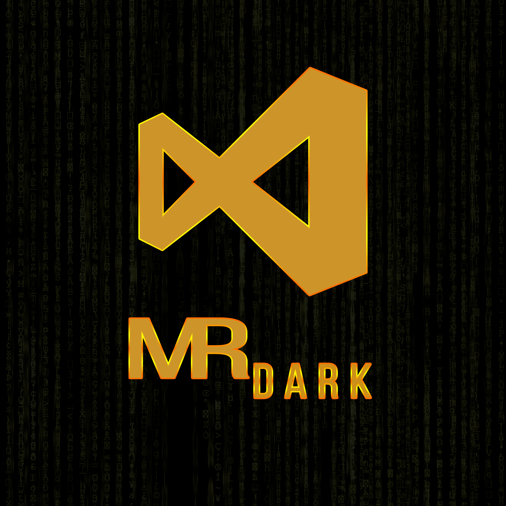
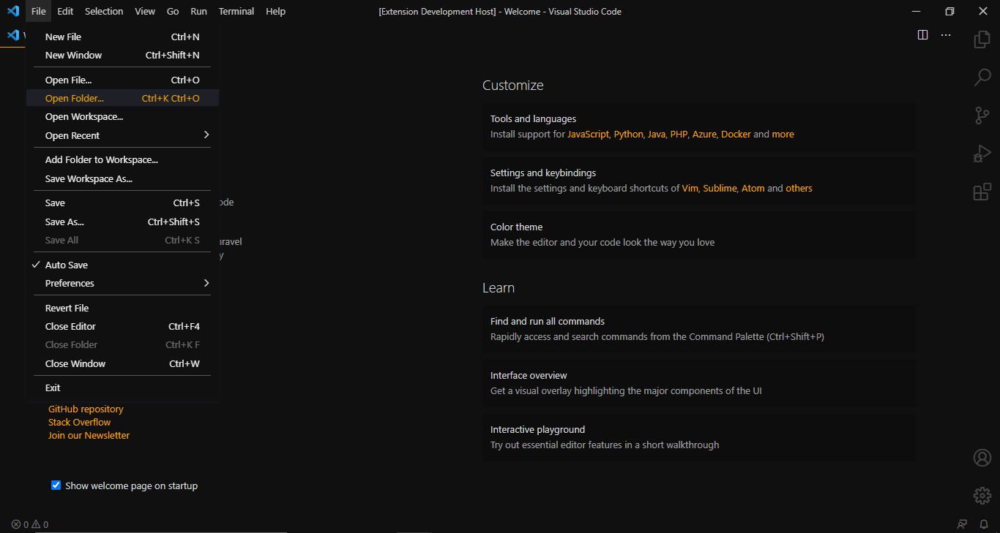
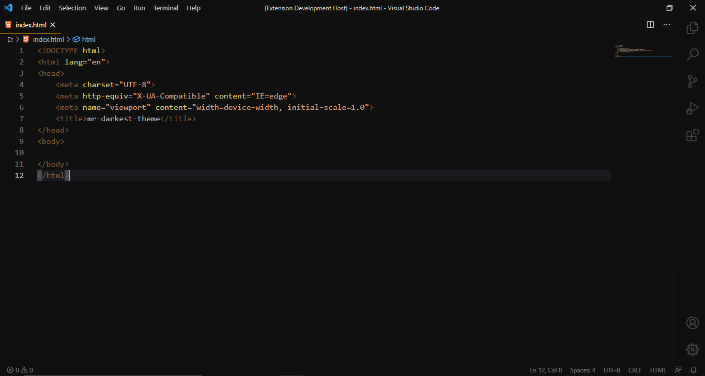

# M.R Darkest Theme

- - -

## v1.0.1 🎨

- Change Object/JSON property names Color

## v1.0.2 🎨

- Change List activeSelectionForeground Color
- Change List highlightForeground Color
- Change PickerGroup Foreground Color
- Change Object/JSON property names Color

## v1.0.3 🎨

- Change Template Expressions Color
- Change activeSelectionForeground Color
- Change prominentHoverBackground Color

## v1.0.4 🎨

- Change activeSelectionForeground Color

## v1.0.5 🎨

- Change editorLineNumberForeground Color
- Change editorLineNumberActiveForeground Color

