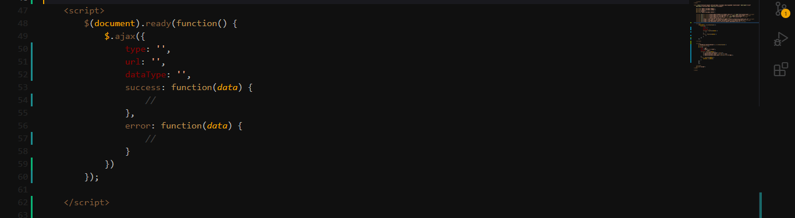
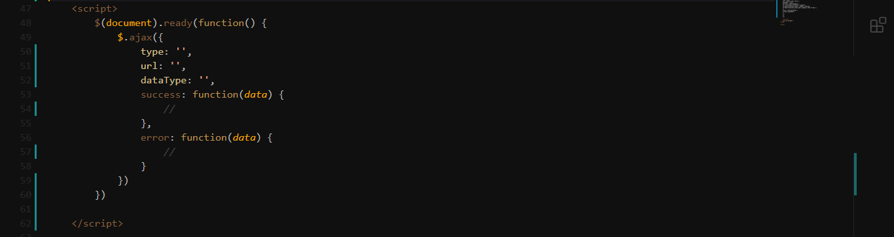
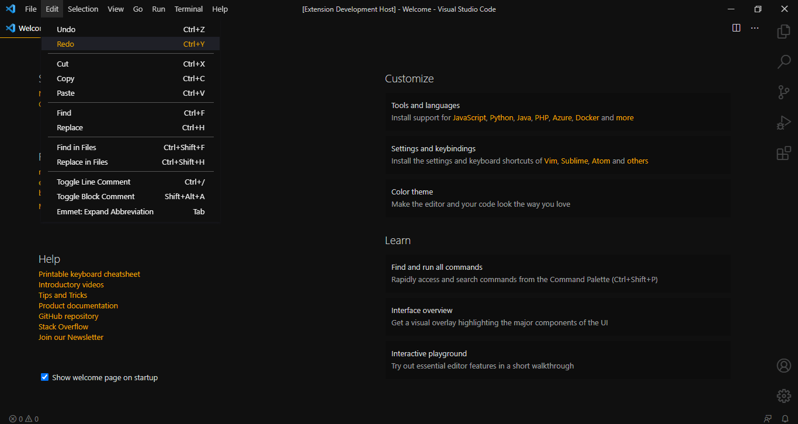
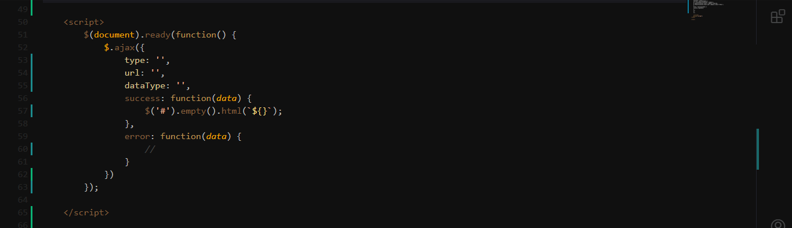
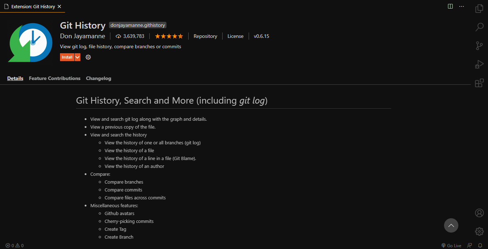
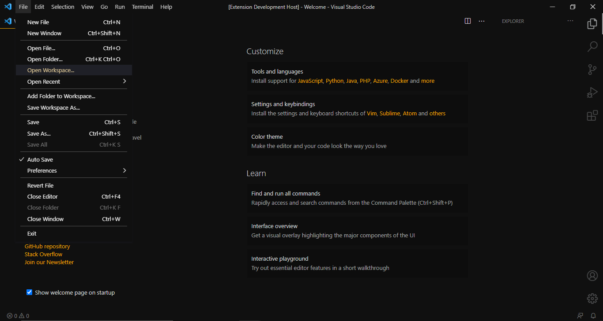

# MR Darkest theme for VSCode

## Here is darkest theme for developers 🤙🎉

[GitHub Repository](https://github.com/mahmoudmohamedramadan/mr-darkest-theme)

**V1.0.1 🎨**
<ul>
 <li>Change Object/JSON property names Color</li>
</ul>

**V1.0.2 🎨**
<ul>
 <li>Change List activeSelectionForeground Color</li>
 <li>Change List highlightForeground Color</li>
 <li>Change PickerGroup Foreground Color</li>
 <li>Change Object/JSON property names Color</li>
</ul>

**V1.0.3 🎨**
<ul>
 <li>Change Template Expressions Color</li>
 <li>Change activeSelectionForeground Color</li>
 <li>Change prominentHoverBackground Color</li>
</ul>

